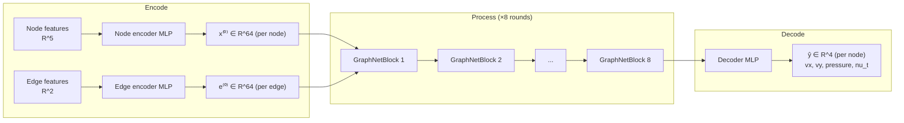

# MeshGraphNet Architecture — Neuron to Forward Pass

This documents the exact model in [`src/model.py`](src/model.py), at the current
sizing in `src/train.py`'s `DEFAULT_MODEL_KWARGS`:

```python
node_in_dim = 7      # [x, y, wall_distance, inlet_vx, inlet_vy, normal_x, normal_y]
edge_in_dim = 2       # [dx, dy] relative position
out_dim = 4           # [vx, vy, pressure, nu_t]
latent_dim = 64
hidden_dim = 128
n_message_passing = 8
```

Total parameters at this sizing: **804,612**.

`normal_x`/`normal_y` (`simulation.normals` -- a unit vector at surface nodes,
`[0, 0]` everywhere else) were added after diagnosing the Cd regression
(section 11): `wall_distance` alone tells the model *how far* a node is from
the wall, never *which direction* into it, so it has no way to resolve the
boundary layer's anisotropy (very different physics along the wall vs. across
it) from that scalar alone. This was already a known gap -- section 9 notes
PyTorch Geometric's own `AirfRANS` dataset ships normals as a standard input
feature; this project's `src/graph.py` simply hadn't used them until now.

## 1. Overview: Encode → Process → Decode



Every node in the mesh graph carries a **latent vector** that starts as a
5-number description of raw geometry, gets refined by 8 rounds of
neighbor-to-neighbor message passing, and ends as a 4-number physical-field
prediction. Edges carry their own latent vector (starting from relative
position) that gets updated alongside the nodes at every round.

## 2. The atomic unit: a single neuron

Every learnable transformation in this model is built from the same primitive
— a linear unit followed optionally by a nonlinearity. For one neuron $j$
receiving inputs $x_1, \dots, x_n$:

$$
y_j = \sum_{i=1}^{n} w_{ji}\, x_i + b_j
$$

$$
z_j = \max(0,\, y_j) \quad \text{(ReLU)}
$$

For a whole layer of $d_{out}$ neurons reading $d_{in}$ inputs at once, this
is a matrix multiply:

$$
\mathbf{y} = W\mathbf{x} + \mathbf{b}, \qquad W \in \mathbb{R}^{d_{out}\times d_{in}},\ \mathbf{b} \in \mathbb{R}^{d_{out}}
$$

That's `nn.Linear(d_in, d_out)` — nothing more exotic happens anywhere in this
model at the neuron level. Every "block" below is just several of these
stacked together.

## 3. The shared MLP shape (`mlp()`, `src/model.py:7`)

Every encoder, decoder, and per-round update in this model is the identical
3-layer shape:

```python
Linear(in_dim, hidden_dim) → ReLU → Linear(hidden_dim, hidden_dim) → ReLU → Linear(hidden_dim, out_dim) → [LayerNorm(out_dim)]
```

For input $\mathbf{x} \in \mathbb{R}^{d_{in}}$:

$$
\mathbf{h}_1 = \mathrm{ReLU}(W_1 \mathbf{x} + \mathbf{b}_1), \qquad W_1 \in \mathbb{R}^{d_{hidden}\times d_{in}}
$$

$$
\mathbf{h}_2 = \mathrm{ReLU}(W_2 \mathbf{h}_1 + \mathbf{b}_2), \qquad W_2 \in \mathbb{R}^{d_{hidden}\times d_{hidden}}
$$

$$
\mathbf{o} = W_3 \mathbf{h}_2 + \mathbf{b}_3, \qquad W_3 \in \mathbb{R}^{d_{out}\times d_{hidden}}
$$

If `layernorm=True` (every MLP except the final decoder):

$$
\mathrm{LayerNorm}(\mathbf{o}) = \gamma \odot \frac{\mathbf{o} - \mu}{\sqrt{\sigma^2 + \epsilon}} + \beta
$$

where $\mu, \sigma^2$ are the mean/variance across $\mathbf{o}$'s own
components, and $\gamma, \beta$ are learned per-component scale/shift. This
keeps latent vectors from drifting to extreme magnitudes across 8 successive
rounds of updates — without it, residual accumulation (section 5) tends to
blow up or vanish over many rounds.

The decoder skips LayerNorm deliberately: its output *is* the physical
prediction, and forcing that to zero-mean-unit-variance would fight against
learning the real target distribution.

## 4. Encoders — raw features into a shared latent space

Two separate MLPs of the shape above, both mapping into the same `latent_dim`
so nodes and edges can be combined later:

$$
\mathbf{x}_i^{(0)} = \mathrm{NodeEncoder}(\mathbf{f}_i), \qquad \mathbf{f}_i \in \mathbb{R}^{7} \to \mathbf{x}_i^{(0)} \in \mathbb{R}^{64}
$$

$$
\mathbf{e}_{ij}^{(0)} = \mathrm{EdgeEncoder}(\mathbf{r}_{ij}), \qquad \mathbf{r}_{ij} \in \mathbb{R}^{2} \to \mathbf{e}_{ij}^{(0)} \in \mathbb{R}^{64}
$$

$i$ indexes mesh nodes; $(i,j)$ indexes directed edges (the mesh graph is
bidirectional — see `src/graph.py` — so every undirected mesh edge produces
two directed entries, $i\to j$ and $j \to i$, each with their own edge
latent vector).

## 5. One message-passing round (`GraphNetBlock`, `src/model.py:20`)

This is the actual "graph" part of the network, and it's the same two-step
computation repeated 8 times (`n_message_passing=8`), each with its own
independently-learned weights.

### Step A — Edge update

For every directed edge $i \to j$, concatenate both endpoints' current node
latents with the edge's own latent, run it through an MLP, and add the
result back (residual):

$$
\mathbf{c}_{ij} = \big[\mathbf{x}_i \,\Vert\, \mathbf{x}_j \,\Vert\, \mathbf{e}_{ij}\big] \in \mathbb{R}^{192} \quad (3 \times 64)
$$

$$
\mathbf{e}_{ij}^{\,\text{new}} = \mathbf{e}_{ij} + \mathrm{EdgeMLP}(\mathbf{c}_{ij})
$$

`EdgeMLP` is the shared MLP shape: $\mathbb{R}^{192} \to \mathbb{R}^{128} \to \mathbb{R}^{128} \to \mathbb{R}^{64}$, LayerNorm'd.

### Step B — Node update (aggregate, then update)

Every node sums the (just-updated) messages coming in from all its mesh
neighbors:

$$
\mathbf{a}_j = \sum_{i \,:\, (i,j) \in \mathcal{E}} \mathbf{e}_{ij}^{\,\text{new}} \in \mathbb{R}^{64}
$$

This is a **scatter-sum** (`torch_geometric.utils.scatter`, `reduce="sum"`) —
for a node with $k$ mesh neighbors, $k$ edge vectors get summed into one.
Then, same residual pattern as the edge update:

$$
\mathbf{c}_j = \big[\mathbf{x}_j \,\Vert\, \mathbf{a}_j\big] \in \mathbb{R}^{128} \quad (2 \times 64)
$$

$$
\mathbf{x}_j^{\,\text{new}} = \mathbf{x}_j + \mathrm{NodeMLP}(\mathbf{c}_j)
$$

`NodeMLP`: $\mathbb{R}^{128} \to \mathbb{R}^{128} \to \mathbb{R}^{128} \to \mathbb{R}^{64}$, LayerNorm'd.

### Why residuals matter here specifically

Both updates are $\mathbf{x}^{\text{new}} = \mathbf{x} + \Delta$, never a
plain replacement. Eight rounds deep, a plain (non-residual) stack would need
every single MLP to get its output magnitude/scale exactly right or the
signal vanishes or explodes; residual connections let each round contribute a
*correction* on top of what's already there, which is both easier to
optimize and closer to how the true physics behaves (each round should
propagate information one mesh-edge further, not overwrite what a node
already "knows").

### The receptive-field consequence

Information can only move one mesh-edge per round. After $n=8$ rounds, a
node's final latent vector has aggregated information from everything within
its **8-hop mesh neighborhood** — no further. This is the direct GNN analogue
of a CFD solver's stencil: a real solver propagates influence through the
mesh incrementally too, just over many more iterations. Increasing
`n_message_passing` widens this receptive field at the cost of more compute
and (importantly here) more activation memory to retain for backprop — see
the note in `src/train.py` about why `64/128/8` was chosen over a larger
`128/128/10` (roughly 4x vs. ~7.5x the activation memory of the original
`32/64/4` sizing).

## 6. Decoder

After the 8th round, one more MLP — **no LayerNorm** this time — maps the
final node latent directly to the predicted physical fields:

$$
\hat{\mathbf{y}}_j = \mathrm{Decoder}(\mathbf{x}_j^{(8)}) \in \mathbb{R}^{4}
$$

$\mathbb{R}^{64} \to \mathbb{R}^{128} \to \mathbb{R}^{128} \to \mathbb{R}^{4}$. These four numbers are
$[\hat v_x, \hat v_y, \hat p, \hat\nu_t]$ in **normalized** units — `src/train.py`'s
`TrainModule` multiplies by `target_std` and adds `target_mean` afterward to
get back to physical units (m/s, Pa-equivalent, etc.) for evaluation and
lift/drag integration.

## 7. Full forward pass — concrete shapes for one real case

Using an actual training case (~180,790 nodes, 724,640 directed edges — see
`src/graph.py`):

| Stage | Operation | Input shape | Output shape |
|---|---|---|---|
| Encode | `NodeEncoder(f)` | `(180790, 7)` | `(180790, 64)` |
| Encode | `EdgeEncoder(r)` | `(724640, 2)` | `(724640, 64)` |
| Process ×8 | `EdgeMLP([x_i‖x_j‖e])` | `(724640, 192)` | `(724640, 64)` |
| Process ×8 | scatter-sum → `NodeMLP([x‖a])` | `(180790, 128)` | `(180790, 64)` |
| Decode | `Decoder(x⁽⁸⁾)` | `(180790, 64)` | `(180790, 4)` |
| Denormalize | `pred·std + mean` | `(180790, 4)` | `(180790, 4)` |

`src/model.py`'s `forward()` is exactly this loop:

```python
def forward(self, node_features, edge_index, edge_attr):
    x = self.node_encoder(node_features)
    e = self.edge_encoder(edge_attr)
    for block in self.blocks:          # 8 iterations
        x, e = block(x, edge_index, e)
    return self.decoder(x)
```

## 8. Loss and what actually gets trained

`TrainModule.training_step` (`src/train.py`) computes plain MSE between
predicted and ground-truth **normalized** targets:

$$
\mathcal{L} = \frac{1}{N \cdot 4}\sum_{j=1}^{N}\sum_{k=1}^{4}\big(\hat y_{j,k} - y_{j,k}\big)^2
$$

Backprop flows through every stage above in reverse — decoder, then each of
the 8 `GraphNetBlock`s in reverse order, then both encoders — updating every
`Linear` layer's $W$ and $\mathbf{b}$ via Adam with cosine-annealed learning
rate (`CosineAnnealingLR`, `T_max=max_epochs`).

Reported *evaluation* metrics (`src/metrics.py`), by contrast, are never the
raw training loss — always **relative L2 per field**, computed after
denormalizing back to physical units, and lift/drag are a further downstream
step entirely (surface integration via AirfRANS's own `force_coefficient()`,
`src/evaluate.py`) — the model above only ever produces the four raw field
predictions; everything past that is post-processing, not something this
network was directly trained to get right (see the Cd/Cl discussion in
project history for why that distinction actually matters here).

## 9. How this compares to production CFD surrogates

Message-passing GNNs on the raw mesh graph (this model, and the original
MeshGraphNets paper it follows) are one of several ways to build a learned
CFD surrogate. Worth naming the alternatives explicitly, since each implies a
different tradeoff than the one made here:

**Geodesic CNNs** (Baque et al., *Geodesic Convolutional Shape Optimization*,
ICML 2018 — the technique behind Neural Concept's original product) remesh
the 3D surface via a polycube map into a *regular* grid, then run ordinary
CNN convolutions on it. This trades the mesh-graph's native irregularity for
GPU-friendly dense convolutions, at the cost of a topology-constraining
remeshing step that this project's mesh-graph approach (`src/graph.py`)
never needs — a directed edge is built directly from AirfRANS's native
triangulation, whatever its topology.

**Neural fields / implicit neural representations** (e.g. Serrano et al.,
*Neural fields for rapid aircraft aerodynamics simulations*, Scientific
Reports 2024) drop the mesh entirely at inference time. Geometry is encoded
once as a signed distance function, compressed into a latent code; a
coordinate-MLP then predicts the field at *any* queried (x, y) point,
independent of mesh resolution. Two consequences follow directly from that
resolution-independence, and both are real GNN weaknesses this project
inherits: message passing (section 5) only propagates information one
mesh-edge per round, so a finer mesh silently *shrinks* the model's physical
receptive field for the same `n_message_passing=8`; and a model trained on
one mesh density degrades on a differently-resolved one, since edge lengths
and neighbor counts (`r_ij`, `a_j` above) shift with the discretization. On
the authors' own benchmark (XRF1 wing, unseen shapes), MeshGraphNets scored
4.4× worse than their neural-field model (relative MSE 0.035 vs. 0.008), and
6% of full mesh resolution trained a neural field good enough to match
full-resolution accuracy — a regime where a mesh-graph GNN typically needs
retraining.

None of this makes message passing the wrong choice here — it's the
architecture the AirfRANS baseline and most recent mesh-based CFD surrogate
literature converge on, and it maps directly onto physical stencil
propagation (section 5's receptive-field note). But the resolution and
generalization limits above are real, inherited by construction, and worth
being explicit about rather than discovering by surprise when evaluating on
an unseen airfoil shape or a re-meshed case.

## 10. Model selection: the checkpoint you'd actually ship isn't "the last one"

A production surrogate's real product is the downstream physical quantity an
engineer reads off it (here, lift/drag coefficients from surface integration
— section 8's "further downstream step"), not the raw per-node field the
network is trained on. Those two can disagree about which checkpoint is
best, and did, twice, in this project:

| epoch | sample | vx | vy | pressure | nu_t | Cl rel. L2 | Cd rel. L2 |
|---|---|---|---|---|---|---|---|
| 9  | 10-case subset | 0.411 | 0.884 | 1.058 | 0.861 | 0.456 | 6.79 |
| 25 | 10-case subset | 0.367 | 0.577 | 0.839 | 0.559 | 0.358 | 2.97 |
| **47** | **full 200-case split** | 0.283 | 0.455 | 0.562 | 0.504 | 0.304 | **3.15 (best)** |
| 77 | 10-case subset | 0.269 | 0.469 | 0.630 | 0.411 | 0.143 | 2.43 |
| 91 | full 200-case split | 0.238 | 0.416 | 0.505 | 0.445 | 0.244 | 3.97 |

(9/25/77 were only cheap-checked on a fixed 10-case slice of the test split
while narrowing down where the regression happens — that slice isn't a
random sample, so don't read its absolute values as trustworthy, only the
shape of the trend. 47 and 91 were the two candidates worth settling with a
full, matched-sample-size run, since they're the "best-by-Cd" and "last
epoch" picks respectively.)

Every field-level metric and Cl improve monotonically from epoch 9 through
91 — confirmed on the full split too, not just the narrowing-down subset.
True Cd relative L2 (measured via AirfRANS's own `force_coefficient()`, not
a training-time proxy), however, is *worse* at epoch 91 (3.97) than at epoch
47 (3.15) despite 44 more epochs of every other metric "improving." This is
the same failure mode that first showed up as the epoch-54-vs-99 regression
on the earlier (pre-weighted-loss) run — the distance-weighted loss
(section 8) softened it (peak Cd relative L2 is lower here than the old
run's 3.03-at-epoch-99), but didn't remove it.

The fix isn't a better loss function (that's a separate, ongoing effort) —
it's not trusting `val_loss` or the final epoch to pick a checkpoint at all.
`TrainModule.validation_step` (`src/train.py`) logs `val_surface_mae_mean`,
a cheap per-epoch proxy computed from the already-cached surface mask (no
mesh/`Simulation` object needed), and a second `ModelCheckpoint` callback
(`best_surface_ckpt`) tracks the single best epoch by that proxy
automatically. It's still a proxy, not the true task metric — the periodic
checkpoints (`mgn-epoch=*.ckpt`, kept via `save_top_k=-1`) stay available so
a handful of candidates near the proxy's optimum can still be spot-checked
against real Cd/Cl (`notebooks/compare_checkpoints.py`) before shipping one.
This mirrors how a production engineering-surrogate pipeline (e.g. Neural
Concept's, section 9) would treat checkpoint selection: as a decision made
against the metric the end user actually cares about, not whatever the
training loop happens to be minimizing.

**Update, section 11 below:** the "epoch 47 is the checkpoint to ship"
conclusion above turned out to be incomplete. Splitting Cd into its pressure
and friction components shows both checkpoints have a badly broken Cd,
through *different* dominant mechanisms — epoch 47 only looks better here
because its particular failure mode happens to sum to a smaller blended
number, not because it's actually solved. See section 11 for the full
picture and what it changes.

## 11. Cd is worse than doing nothing — diagnosing why

Section 10 treated Cd relative L2 (3.15–3.97) as "bad but real, pick the
least-bad checkpoint." That undersold it. Three checks (prompted by an
outside review of this project — the questions were generic ML-surrogate
debugging steps, but worth actually running rather than dismissing):

**A constant-prediction floor.** Predicting the training-set mean Cd
(0.0123) for every one of the 200 test cases — a "model" that ignores the
input entirely — gets **35.1% relative L2**. Both real checkpoints are far
worse than that (epoch 47: 291%, epoch 91: 335%, on a matched 30-case
subset). A model that learned nothing about the geometry would outperform
what's currently being shipped.

**Negative predicted Cd.** Physically impossible for an airfoil — drag
can't be negative. Confirmed in both checkpoints (epoch 47's predicted Cd
ranged from -0.042 to 0.155 across the subset; epoch 91's from -0.005 to
0.135). This is direct evidence of the *cancellation* failure mode drag
integration is prone to: `Simulation.force()` (`airfrans/simulation.py` —
surface integral of pressure and wall shear stress over the airfoil, called
from `src/evaluate.py::evaluate_case` rather than reimplemented) sums large,
nearly-opposite fore/aft contributions into a small residual. When the
fields feeding that integral are off by enough, the residual stops being
small-and-positive and starts being noise centered near zero.

**Splitting Cd into pressure drag (`cdp`) and friction drag (`cdv`)**
(`force_coefficient()` returns both; `evaluate_case` previously discarded
them with `(cd_pred, _, _)`, keeping only the sum) shows the failure mode
*isn't fixed* across training — it moves:

| | cdp (pressure drag) | cdv (friction drag) | clv (viscous lift) |
|---|---|---|---|
| epoch 47 | 5.38 (catastrophic) | 0.67 (comparatively fine) | 2.01 |
| epoch 91 | 3.63 (bad, but improved) | 7.42 (catastrophic) | 19.06 |

At epoch 47, Cd is broken mainly through pressure drag. At epoch 91, pressure
drag actually got *better*, but friction drag got 11x worse. This directly
contradicts a simpler pressure-only story: section 10's region breakdown
found surface pressure *MAE* got worse from epoch 47 to 91, which reads as
"pressure regressed" — but the *signed, integrated* pressure-drag error
improved over that same span. Pointwise error magnitude and integrated
force error aren't the same thing; error *structure* (whether errors on the
front and back surface reinforce or cancel) matters more than magnitude for
a quantity defined by cancellation. What's actually unstable across training
is friction drag — the term that depends on the wall-normal *gradient* of
velocity, not the raw field. (`clv`'s 2 → 19 jump is likely not meaningful
on its own: viscous lift is physically near-zero for an airfoil, so a tiny
absolute error there produces an enormous relative one — the same
near-zero-denominator caveat already in `mean_abs_error_per_field`'s
docstring, section 8.)

**Ruling out the two cheapest explanations.** An "integrator bug" (e.g. a
missing freestream-angle rotation before splitting force into drag/lift)
would explain a fixed, large offset — but section [Cd/Cl formulation]
already confirmed `force_coefficient()` does that rotation, and this project
calls that library function directly rather than reimplementing it, so this
class of bug doesn't apply. A de-normalization leak (e.g. volume-node
statistics wrongly applied to surface nodes) would also explain a
consistent, near-constant-factor error — but `norm_stats.npz` is one global
set of stats applied uniformly to every node, at both train and eval time
(verified directly), so there's no separate surface/volume normalization
path to leak between.

**What's left, and the fix this points at.** The distance-weighted loss
(section 8) up-weights every field's raw MSE near the wall by proximity —
it rewards getting the near-wall *value* right, but has no way to reward
getting the near-wall *gradient* right, and friction drag depends
specifically on that gradient. The model can satisfy the loss by fitting
near-wall velocity values closely while still smoothing the boundary layer
just enough to corrupt the derivative feeding wall shear stress — invisible
to both `val_loss` and the field-level relative L2, only visible in `cdv`.

First corrective step taken: **`src/graph.py` now includes `simulation.normals`**
(a unit vector at surface nodes, `[0, 0]` elsewhere) as two additional node
features (section 1's `node_in_dim` 5 → 7). `wall_distance` alone told the
model how far a node was from the wall but never which direction was "into"
it — without that, it has no way to represent the boundary layer's
anisotropy (very different physics along the wall vs. across it) from a
single scalar. This is a plumbing fix, not a claim that it solves the
regression — `norm_stats.npz` was recomputed for the new feature width and
the overfit sanity check (section 3's "does it even run" bar, not a real
result) confirms the pipeline still trains, but it needs a real Kaggle/Colab
run and a repeat of this section's diagnostics to know whether it actually
moves `cdv`.

**Attempted second step, found not ready: a wall-shear-gradient proxy loss**
(`wall_shear_gradient_proxy`, `src/train.py`) — the idea was a cheap,
self-consistent auxiliary loss comparing a finite-difference estimate of the
wall-normal velocity gradient (computed from predicted vs. true velocity,
never against AirfRANS's real wall shear stress) at surface nodes, using the
nearest mesh edge as the finite-difference direction. Checking its edge
selection against this dataset's actual mesh topology (not just "does it
run without crashing," which it does) found it isn't sound as designed: for
a surface node's outward-pointing neighbors, the median direction cosine to
the local normal was 0.0002 — essentially tangent — and only 2 edges in an
entire ~720k-edge mesh exceeded cos > 0.1. Most of a surface node's mesh
neighbors are other surface points along the boundary loop; a mesh edge
that actually points straight into the domain, aligned with the local
normal, is rare rather than the common case a single-nearest-edge finite
difference assumed. The function is left in the codebase (weight defaults
to 0.0 and should stay there) rather than removed, since the raw-normal
node feature and dataset plumbing it depends on (`src/dataset.py`'s
`normal` field) are still correct and reusable — but the gradient estimate
itself needs either a proper multi-neighbor least-squares reconstruction
(closer to what AirfRANS's own VTK derivative actually does) or a
KDTree-based nearest-off-wall-point lookup instead of raw mesh-edge
adjacency, and should be validated by correlating it against
`Simulation.wallshearstress()` on a real case *before* it's ever wired into
a training loss again, not after.
