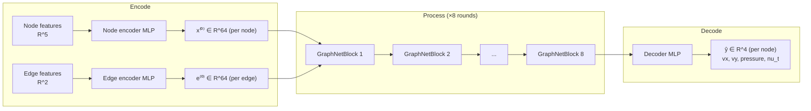

# MeshGraphNet Architecture — Neuron to Forward Pass

This documents the exact model in [`src/model.py`](src/model.py), at the current
sizing in `src/train.py`'s `DEFAULT_MODEL_KWARGS`:

```python
node_in_dim = 5      # [x, y, wall_distance, inlet_vx, inlet_vy]
edge_in_dim = 2       # [dx, dy] relative position
out_dim = 4           # [vx, vy, pressure, nu_t]
latent_dim = 64
hidden_dim = 128
n_message_passing = 8
```

Total parameters at this sizing: **804,356**.

## 1. Overview: Encode → Process → Decode



Every node in the mesh graph carries a **latent vector** that starts as a
5-number description of raw geometry, gets refined by 8 rounds of
neighbor-to-neighbor message passing, and ends as a 4-number physical-field
prediction. Edges carry their own latent vector (starting from relative
position) that gets updated alongside the nodes at every round.

## 2. The atomic unit: a single neuron

Every learnable transformation in this model is built from the same primitive
— a linear unit followed optionally by a nonlinearity. For one neuron $j$
receiving inputs $x_1, \dots, x_n$:

$$
y_j = \sum_{i=1}^{n} w_{ji}\, x_i + b_j
$$

$$
z_j = \max(0,\, y_j) \quad \text{(ReLU)}
$$

For a whole layer of $d_{out}$ neurons reading $d_{in}$ inputs at once, this
is a matrix multiply:

$$
\mathbf{y} = W\mathbf{x} + \mathbf{b}, \qquad W \in \mathbb{R}^{d_{out}\times d_{in}},\ \mathbf{b} \in \mathbb{R}^{d_{out}}
$$

That's `nn.Linear(d_in, d_out)` — nothing more exotic happens anywhere in this
model at the neuron level. Every "block" below is just several of these
stacked together.

## 3. The shared MLP shape (`mlp()`, `src/model.py:7`)

Every encoder, decoder, and per-round update in this model is the identical
3-layer shape:

```python
Linear(in_dim, hidden_dim) → ReLU → Linear(hidden_dim, hidden_dim) → ReLU → Linear(hidden_dim, out_dim) → [LayerNorm(out_dim)]
```

For input $\mathbf{x} \in \mathbb{R}^{d_{in}}$:

$$
\mathbf{h}_1 = \mathrm{ReLU}(W_1 \mathbf{x} + \mathbf{b}_1), \qquad W_1 \in \mathbb{R}^{d_{hidden}\times d_{in}}
$$

$$
\mathbf{h}_2 = \mathrm{ReLU}(W_2 \mathbf{h}_1 + \mathbf{b}_2), \qquad W_2 \in \mathbb{R}^{d_{hidden}\times d_{hidden}}
$$

$$
\mathbf{o} = W_3 \mathbf{h}_2 + \mathbf{b}_3, \qquad W_3 \in \mathbb{R}^{d_{out}\times d_{hidden}}
$$

If `layernorm=True` (every MLP except the final decoder):

$$
\mathrm{LayerNorm}(\mathbf{o}) = \gamma \odot \frac{\mathbf{o} - \mu}{\sqrt{\sigma^2 + \epsilon}} + \beta
$$

where $\mu, \sigma^2$ are the mean/variance across $\mathbf{o}$'s own
components, and $\gamma, \beta$ are learned per-component scale/shift. This
keeps latent vectors from drifting to extreme magnitudes across 8 successive
rounds of updates — without it, residual accumulation (section 5) tends to
blow up or vanish over many rounds.

The decoder skips LayerNorm deliberately: its output *is* the physical
prediction, and forcing that to zero-mean-unit-variance would fight against
learning the real target distribution.

## 4. Encoders — raw features into a shared latent space

Two separate MLPs of the shape above, both mapping into the same `latent_dim`
so nodes and edges can be combined later:

$$
\mathbf{x}_i^{(0)} = \mathrm{NodeEncoder}(\mathbf{f}_i), \qquad \mathbf{f}_i \in \mathbb{R}^{5} \to \mathbf{x}_i^{(0)} \in \mathbb{R}^{64}
$$

$$
\mathbf{e}_{ij}^{(0)} = \mathrm{EdgeEncoder}(\mathbf{r}_{ij}), \qquad \mathbf{r}_{ij} \in \mathbb{R}^{2} \to \mathbf{e}_{ij}^{(0)} \in \mathbb{R}^{64}
$$

$i$ indexes mesh nodes; $(i,j)$ indexes directed edges (the mesh graph is
bidirectional — see `src/graph.py` — so every undirected mesh edge produces
two directed entries, $i\to j$ and $j \to i$, each with their own edge
latent vector).

## 5. One message-passing round (`GraphNetBlock`, `src/model.py:20`)

This is the actual "graph" part of the network, and it's the same two-step
computation repeated 8 times (`n_message_passing=8`), each with its own
independently-learned weights.

### Step A — Edge update

For every directed edge $i \to j$, concatenate both endpoints' current node
latents with the edge's own latent, run it through an MLP, and add the
result back (residual):

$$
\mathbf{c}_{ij} = \big[\mathbf{x}_i \,\Vert\, \mathbf{x}_j \,\Vert\, \mathbf{e}_{ij}\big] \in \mathbb{R}^{192} \quad (3 \times 64)
$$

$$
\mathbf{e}_{ij}^{\,\text{new}} = \mathbf{e}_{ij} + \mathrm{EdgeMLP}(\mathbf{c}_{ij})
$$

`EdgeMLP` is the shared MLP shape: $\mathbb{R}^{192} \to \mathbb{R}^{128} \to \mathbb{R}^{128} \to \mathbb{R}^{64}$, LayerNorm'd.

### Step B — Node update (aggregate, then update)

Every node sums the (just-updated) messages coming in from all its mesh
neighbors:

$$
\mathbf{a}_j = \sum_{i \,:\, (i,j) \in \mathcal{E}} \mathbf{e}_{ij}^{\,\text{new}} \in \mathbb{R}^{64}
$$

This is a **scatter-sum** (`torch_geometric.utils.scatter`, `reduce="sum"`) —
for a node with $k$ mesh neighbors, $k$ edge vectors get summed into one.
Then, same residual pattern as the edge update:

$$
\mathbf{c}_j = \big[\mathbf{x}_j \,\Vert\, \mathbf{a}_j\big] \in \mathbb{R}^{128} \quad (2 \times 64)
$$

$$
\mathbf{x}_j^{\,\text{new}} = \mathbf{x}_j + \mathrm{NodeMLP}(\mathbf{c}_j)
$$

`NodeMLP`: $\mathbb{R}^{128} \to \mathbb{R}^{128} \to \mathbb{R}^{128} \to \mathbb{R}^{64}$, LayerNorm'd.

### Why residuals matter here specifically

Both updates are $\mathbf{x}^{\text{new}} = \mathbf{x} + \Delta$, never a
plain replacement. Eight rounds deep, a plain (non-residual) stack would need
every single MLP to get its output magnitude/scale exactly right or the
signal vanishes or explodes; residual connections let each round contribute a
*correction* on top of what's already there, which is both easier to
optimize and closer to how the true physics behaves (each round should
propagate information one mesh-edge further, not overwrite what a node
already "knows").

### The receptive-field consequence

Information can only move one mesh-edge per round. After $n=8$ rounds, a
node's final latent vector has aggregated information from everything within
its **8-hop mesh neighborhood** — no further. This is the direct GNN analogue
of a CFD solver's stencil: a real solver propagates influence through the
mesh incrementally too, just over many more iterations. Increasing
`n_message_passing` widens this receptive field at the cost of more compute
and (importantly here) more activation memory to retain for backprop — see
the note in `src/train.py` about why `64/128/8` was chosen over a larger
`128/128/10` (roughly 4x vs. ~7.5x the activation memory of the original
`32/64/4` sizing).

## 6. Decoder

After the 8th round, one more MLP — **no LayerNorm** this time — maps the
final node latent directly to the predicted physical fields:

$$
\hat{\mathbf{y}}_j = \mathrm{Decoder}(\mathbf{x}_j^{(8)}) \in \mathbb{R}^{4}
$$

$\mathbb{R}^{64} \to \mathbb{R}^{128} \to \mathbb{R}^{128} \to \mathbb{R}^{4}$. These four numbers are
$[\hat v_x, \hat v_y, \hat p, \hat\nu_t]$ in **normalized** units — `src/train.py`'s
`TrainModule` multiplies by `target_std` and adds `target_mean` afterward to
get back to physical units (m/s, Pa-equivalent, etc.) for evaluation and
lift/drag integration.

## 7. Full forward pass — concrete shapes for one real case

Using an actual training case (~180,790 nodes, 724,640 directed edges — see
`src/graph.py`):

| Stage | Operation | Input shape | Output shape |
|---|---|---|---|
| Encode | `NodeEncoder(f)` | `(180790, 5)` | `(180790, 64)` |
| Encode | `EdgeEncoder(r)` | `(724640, 2)` | `(724640, 64)` |
| Process ×8 | `EdgeMLP([x_i‖x_j‖e])` | `(724640, 192)` | `(724640, 64)` |
| Process ×8 | scatter-sum → `NodeMLP([x‖a])` | `(180790, 128)` | `(180790, 64)` |
| Decode | `Decoder(x⁽⁸⁾)` | `(180790, 64)` | `(180790, 4)` |
| Denormalize | `pred·std + mean` | `(180790, 4)` | `(180790, 4)` |

`src/model.py`'s `forward()` is exactly this loop:

```python
def forward(self, node_features, edge_index, edge_attr):
    x = self.node_encoder(node_features)
    e = self.edge_encoder(edge_attr)
    for block in self.blocks:          # 8 iterations
        x, e = block(x, edge_index, e)
    return self.decoder(x)
```

## 8. Loss and what actually gets trained

`TrainModule.training_step` (`src/train.py`) computes plain MSE between
predicted and ground-truth **normalized** targets:

$$
\mathcal{L} = \frac{1}{N \cdot 4}\sum_{j=1}^{N}\sum_{k=1}^{4}\big(\hat y_{j,k} - y_{j,k}\big)^2
$$

Backprop flows through every stage above in reverse — decoder, then each of
the 8 `GraphNetBlock`s in reverse order, then both encoders — updating every
`Linear` layer's $W$ and $\mathbf{b}$ via Adam with cosine-annealed learning
rate (`CosineAnnealingLR`, `T_max=max_epochs`).

Reported *evaluation* metrics (`src/metrics.py`), by contrast, are never the
raw training loss — always **relative L2 per field**, computed after
denormalizing back to physical units, and lift/drag are a further downstream
step entirely (surface integration via AirfRANS's own `force_coefficient()`,
`src/evaluate.py`) — the model above only ever produces the four raw field
predictions; everything past that is post-processing, not something this
network was directly trained to get right (see the Cd/Cl discussion in
project history for why that distinction actually matters here).
